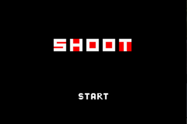
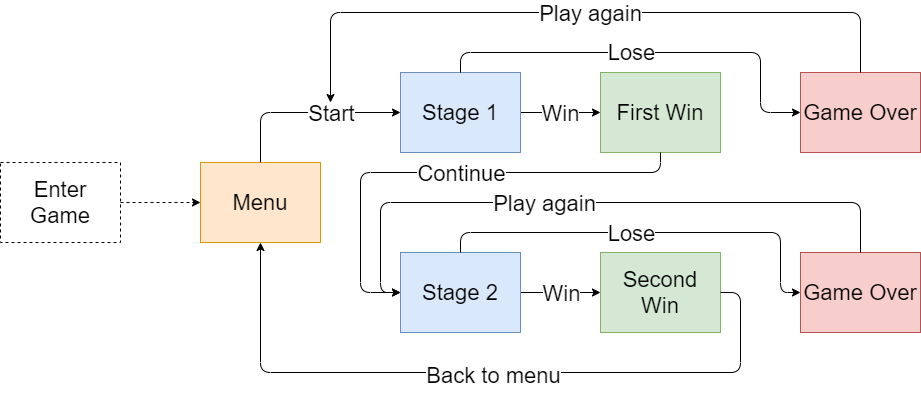

<p align="center">
  
</p>

This repository is maintained by [Khe Yang](https://github.com/kheyang) & [Jin Wei](https://github.com/heyjinwei).

# SHOOT!

A GameBoy Advance game developed with the [HAM IDE and compiler](https://en.wikibooks.org/wiki/GBA_Development/HAM_IDE), for the project submission of ME3241 - Microprocessor Applications.

## Getting Started

Download the [latest release](https://github.com/kheyang/GBA_3241/releases) or make your own GBA ROM file by following the steps below.

The development of this project was done on [HAM 2.70](https://www.cameronjtinker.com/posts/gba-development-with-ham-271-sdk-for-windows), which can be downloaded from the embedded URL.

After the environment is properly setup with the GBA emulator and HAM compiler, the ROM file can be obtained by running

```shell
make
```

or

```shell
make clean all
```

at the project directory.

Then, the GBA ROM file will be available for use. Simply open the file in the emulator and start SHOOTing.

## Playing the Game

<p align="center">
  
</p>

Press the START button to start the game!

### Objective

SHOOT the enemy and don't get SHOT! Dodge the attack or shield it to reduce the damage received! To win the game, beat the enemies in both stages!

### Controls

Joypad Button | Description
------------ | -------------
Up | Move up
Down | Move down
Left | Move left
Right | Move right
A | Fire Rocket
B | Activate Shield

Rockets can only be fired when available and when the shield is not activated. 

### Enemies to Defeat

Can you defeat them all?

#### Evil Twin

- Difficulty: 1/5

<p align="center">
  
</p>

#### Fire Magician

- Difficulty: 4/5
- Teleports
- Fireballs track you

<p align="center">
  
</p>

## Development

### Game Flow

<p align="center">
  
</p>

### Architecture

SHOOT! is built on a state-based architecture where the display and control is reliant on the game state. 

In the current architecture, 4 different states have been implemented, namely MENU (0), BATTLE (1), WIN (2) and GAME OVER (3) states.

The interrupt handler will run respective code blocks based on the game state when it is triggered. 

### Navigating the Repo

`main.c` 

Driver codes & game logic

`mygbalib.h`

Button logic & sprites displaying

`sprites.h`

Sprites & palette
